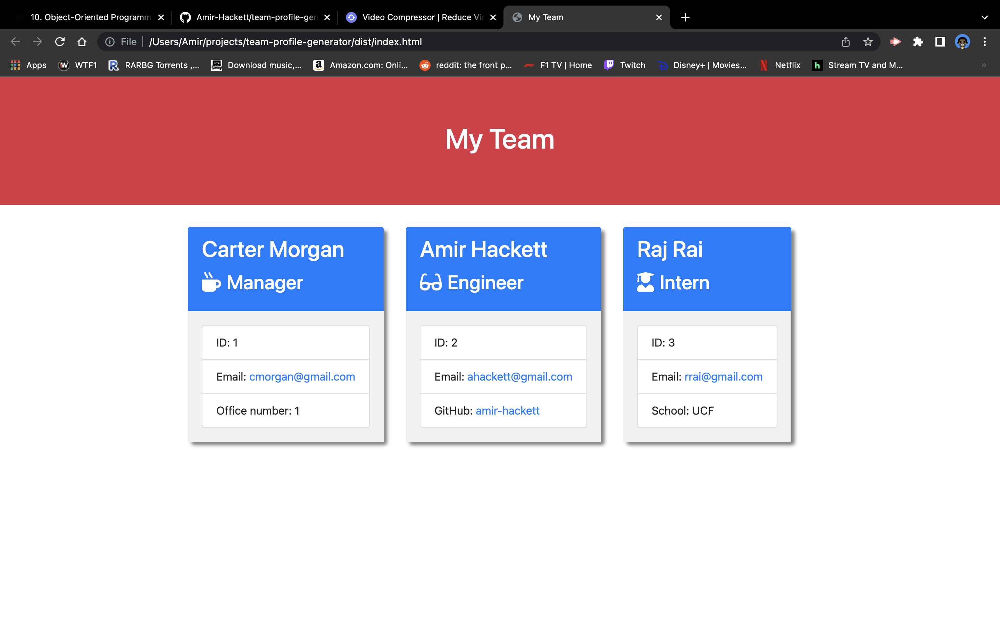

# Team-Profile-Generator

 ## Licensing:
  

  ## Table of Contents 
  - [Presentation](#presentation)
  - [Screen Shot](#screenshot)
  - [Description](#description)
  - [Installation](#installation)
  - [Usage](#usage)

  ## Presentation
  https://user-images.githubusercontent.com/99042050/165751734-bd842c9c-4d52-4652-9dbf-1036638a4513.mp4

  ## Screenshot
  This is a screenshot of the generated HTML webpage.

 

  ## Description:
  The above video is a demonstration of how this application is supposed to work. 
  
  - WHEN I am prompted for my team members and their information
    - THEN an HTML file is generated that displays a nicely formatted team roster based on user input
  - WHEN I click on an email address in the HTML
    - THEN my default email program opens and populates the TO field of the email with the address
  - WHEN I click on the GitHub username
    - THEN that GitHub profile opens in a new tab
  - WHEN I start the application
    - THEN I am prompted to enter the team manager’s name, employee ID, email address, and office number
  - WHEN I enter the team manager’s name, employee ID, email address, and office number
    - THEN I am presented with a menu with the option to add an engineer or an intern or to finish building my team
  - WHEN I select the engineer option
    - THEN I am prompted to enter the engineer’s name, ID, email, and GitHub username, and I am taken back to the menu
  - WHEN I select the intern option
    - THEN I am prompted to enter the intern’s name, ID, email, and school, and I am taken back to the menu
 - WHEN I decide to finish building my team
    - THEN I exit the application, and the HTML is generated

  ## Installation:
  - Download through Github
  - Requires express & inquirer to be installed

  ## Usage:
  - Open in the terminal
  - Type 'node index.js'
  - Answer the prompts that follow
  - On success an index.html will be generated in the dist folder.
